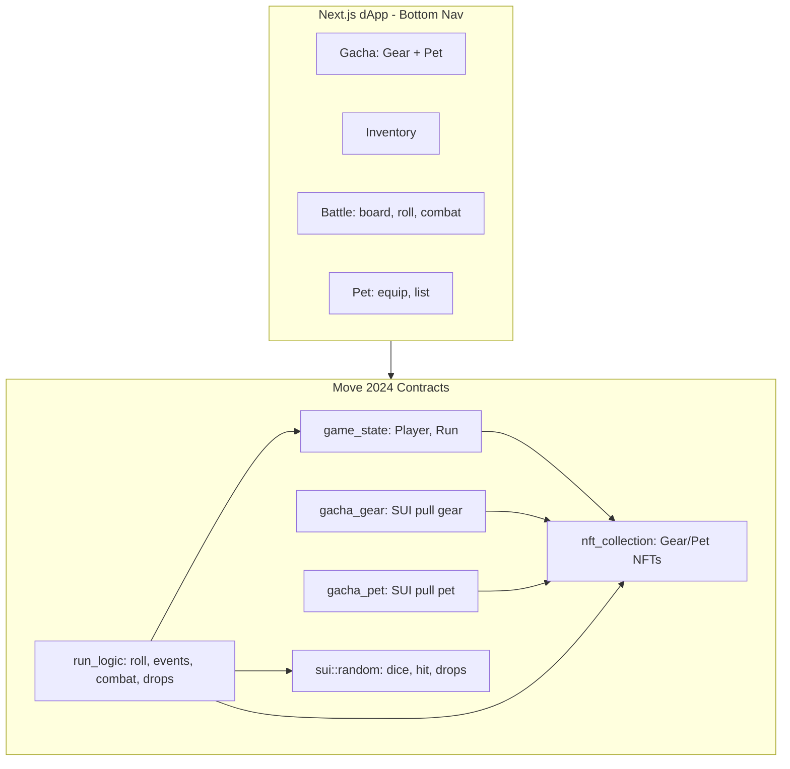

# SuiVenture MVP – Detailed Implementation Plan

Based on [docs/PRD.md](docs/PRD.md) and current repo state: Move has only a stub module ([move/sources/sui_venture.move](move/sources/sui_venture.move)); dApp has wallet + Header ([dapp/src](dapp/src)); deploy uses [ts-utils/src/scripts/deploy.ts](ts-utils/src/scripts/deploy.ts).

---

## 1. Architecture Overview

- **Data**: Player (persistent), Run (per-session), Equipment/Pet NFTs (persistent). Run holds temp equipment, potions, blue gems, floor, roll count.
- **Flow**: Connect wallet → Gacha Gear / Gacha Pet (separate) → Equip (Inventory/Pet) → Battle (Start Run → Roll → Event → Win/die). When run ends (win), drops: temp/permanent items and pet chances per catalog below.

---

## 2. Move Smart Contracts (Move 2024)

**Conventions**: Follow [move/MOVE_BEST_PRACTICE.md](move/MOVE_BEST_PRACTICE.md) (module label style, grouped `use`, named address prefix) and [move/BETTER_ERROR_HANDLING.md](move/BETTER_ERROR_HANDLING.md) (distinct abort codes, safe check functions where useful).

### 2.1 Module Layout

| Module             | Purpose                                 | Key types / functions                                                                                                 |
| ------------------ | --------------------------------------- | --------------------------------------------------------------------------------------------------------------------- |
| **game_state**     | Player & Run objects, one-time init     | `Player`, `Run`, `start_run`, `end_run`                                                                               |
| **nft_collection** | Permanent Gear & Pet NFTs               | `EquipmentNFT`, `PetNFT`; rarity enum: Normal / Rare / Epic / Legend / Mystic (5 tiers)                               |
| **gacha_gear**     | Paid pulls, mint gear only              | `GachaGear` (shared), `pull_gear(coin)` → random slot + rarity (weighted), mint EquipmentNFT                          |
| **gacha_pet**      | Paid pulls, mint pet only               | `GachaPet` (shared), `pull_pet(coin)` → random pet_id + rarity (weighted), mint PetNFT                                |
| **run_logic**      | Roll, move, events, combat, shop, drops | 2d6, events, combat, end-run drops from catalog; uses `sui::random`                                                   |
| **upgrade**        | Merge 3 same items → 1 next rarity      | `upgrade_gear(three same slot+set_id+rarity)` / `upgrade_pet(three same pet_id+rarity)`; burn 3, mint 1 higher rarity |
| **marketplace**    | List / buy via Sui Kiosk, 5% admin fee  | TransferPolicy for EquipmentNFT & PetNFT with custom rule (5% to admin); list = place+list, buy = purchase + confirm  |

Suggested file split under [move/sources/](move/sources/): `game_state.move`, `nft_collection.move`, `gacha_gear.move`, `gacha_pet.move`, `run_logic.move`, `upgrade.move`, `marketplace.move` (or fewer files with multiple module blocks). Package name `sui_venture_project` (already in [move/Move.toml](move/Move.toml)).

### 2.2 game_state

- **Player** (owned): `id`, optional `cap` for dynamic fields; stored aggregates: base ATK/HP/ACC/DEF, blue_gems, equipped permanent gear IDs (4 slots: Helmet, Weapon, Shield, Boots), pet ID. Optionally a `Character` display/name for frontend.
- **Run** (owned, created per run): `id`, `player_id`, current/max HP, temp ATK/ACC/DEF (base + permanent + temp), floor (1–15), position_on_board, roll_count_this_run, blue_gems (in-run), temp equipment slots (same 4), potion_count, potion_heal_amount, potion_max_carry, board_tile_count, “boss phase” / “shop available” derived from roll_count and floor.
- **One-time init**: Create shared/package-owned admin or config if needed (e.g. gacha price, board size). For MVP, constants in code are acceptable.
- **Entry / API**: `start_run(player, player_cap)` creates Run, deducts nothing (blue gems spent in-run only). `end_run(run, …)` burns Run and optionally updates Player (e.g. final blue gems back to Player if “win” path added later).

### 2.3 nft_collection

- **Rarity** (5 tiers): `Normal` (0), `Rare` (1), `Epic` (2), `Legend` (3), `Mystic` (4). Use in both Equipment and Pet.
- **EquipmentNFT**: (slot: u8, set_id: u8, rarity: u8, stats). Slots: Helmet, Weapon, Shield, Boots. **set_id** 0 or 1 → 2 sets × 4 slots = **8 art assets**; rarity is tier overlay only (see §2.3.1). Stats: bonus ATK, HP, ACC, DEF.
- **PetNFT**: (pet_id: u8, rarity: u8, bonus_type, bonus_value). **pet_id** 0–4 → **5 art assets**; rarity is tier overlay only (see §2.3.1).
- Sui object/NFT patterns (Display, TransferPolicy if needed). Mint via `gacha_gear` / `gacha_pet` (each holds MintCap or shared ref to nft_collection).

#### 2.3.1 Item & Pet Catalog (MVP – for drops and art gen)

Fixed catalog so contract and frontend share the same IDs for art and drops when run ends (win).

**Art model: same art per (set + slot) or per pet; rarity = tier overlay only.**  

- **Gear**: Art is shared by rarity — same artwork per slot within a “set”; only the tier (Normal / Rare / … / Mystic) changes border/color overlay. **2 sets of gear = 8 art assets total**: Set A (Helmet, Weapon, Shield, Boots) + Set B (Helmet, Weapon, Shield, Boots). So `set_id` (0 or 1) × 4 slots = 8 images. Rarity does not add new art; use one image per (set_id, slot), apply rarity overlay in UI.  
- **Pet**: Same idea — **5 pet arts** (one per pet_id). Rarity is tier overlay only; no separate art per rarity.

**Gear (slot, set_id, rarity, stats):**  

- 4 slots × 2 set_id = 8 visual variants. Rarity (5 tiers) is metadata + overlay. Catalog: (slot, set_id, rarity) for stats; frontend uses (set_id, slot) for image, rarity for frame/color.

**Pets (pet_id, rarity):**  

- 5 pets; one art per pet_id. Example list for art:

| pet_id | Name (example) | Bonus type   | Art hint     |
| ------ | -------------- | ------------ | ------------ |
| 0      | Ember          | +ATK %       | Fire critter |
| 1      | Shell          | +DEF flat    | Turtle       |
| 2      | Whisper        | +ACC %       | Ghost        |
| 3      | Bloom          | +HP regen    | Plant        |
| 4      | Spark          | +Crit chance | Electric     |

When run ends (win): drop from same catalog (roll slot + set_id + rarity for gear, pet_id + rarity for pet); mint permanent EquipmentNFT or PetNFT.

### 2.4 gacha_gear & gacha_pet (two separate gachas)

- **GachaGear** (shared object): holds SUI from pulls, price (e.g. 0.01 SUI), ref to nft_collection. `pull_gear(coin, ctx)`: take SUI, use `sui::random` to pick slot (Helmet/Weapon/Shield/Boots) and rarity (weighted: Normal > Rare > Epic > Legend > Mystic), mint EquipmentNFT from catalog, transfer to sender, deposit SUI.
- **GachaPet** (shared object): same idea. `pull_pet(coin, ctx)`: pick pet_id and rarity (weighted), mint PetNFT from catalog, transfer to sender, deposit SUI.
- **Events**: Emit (sender, minted_object_id, type_gear_or_pet, rarity, slot_or_pet_id) for indexers/frontend.

### 2.5 run_logic

- **Dice**: `roll_2d6(ctx)` → use `sui::random` to generate two u8 in [1,6], return sum (2–12).
- **Move**: Advance Run’s position by dice, wrap on board. Determine tile type (event type) from position or random.
- **Events**: Enum: Combat, LuckyGacha, BadEvent, Heal. Procedural/simple mapping per tile.
- **Combat**: Player attacks first (d100 ≤ ACC → dmg = max(1, ATK - enemy DEF)); enemies counter. Use `sui::random` for d100 and for in-combat drops (temp equipment + blue gems). Enemies scale with Run.floor.
- **Lucky gacha (in-run)**: Temp item (level-scaled) or +1 potion; no SUI cost.
- **Bad event / Heal / Floor completion / Shop / Boss phase / Potions**: As in original plan (shop every 3 floors, boss every 5 rolls, potion use anytime).
- **End-of-run drops (when player wins)**: When run completes (floor 15 + boss defeated), resolve drops from the same **Item & Pet catalog** (§2.3.1): roll slot + rarity for gear and/or pet_id + rarity for pet (weighted), then mint permanent EquipmentNFT or PetNFT to player. List of droppable types = same as gacha catalog (gear slots × 5 rarities, 5 pets × 5 rarities) so art set is shared between gacha and run rewards.

All run_logic entry functions take `&mut Run` (or Run by value and return it), plus `RandomGenerator`/ctx for randomness. Run must be authorized (e.g. Run.owner == ctx.sender() or via cap).

### 2.6 Upgrade (3 same items → 1 next rarity)

- **Gear**: `upgrade_gear(item_a, item_b, item_c, ctx)`: Require all three are EquipmentNFT with **same slot** and **same rarity**. Burn all three, mint one EquipmentNFT with same slot and **next rarity** (Normal→Rare→Epic→Legend→Mystic). Mystic cannot be upgraded (abort or no-op).
- **Pet**: `upgrade_pet(pet_a, pet_b, pet_c, ctx)`: Require all three are PetNFT with **same pet_id** and **same rarity**. Burn three, mint one PetNFT with same pet_id and next rarity. Mystic cannot be upgraded.
- **Checks**: Verify same type (all gear or all pet), same slot/pet_id, same rarity; enforce exactly 3; caller owns all. Use distinct abort codes (ENotSameSlot, ENotSameRarity, EMaxRarity, etc.).
- **Stats**: Minted item’s stats can be formula from rarity (e.g. higher rarity = better stats) or fixed per catalog.

### 2.7 Marketplace (Sui Kiosk + 5% admin fee)

**Sui Kiosk** supports list and buy natively; **TransferPolicy** enforces rules (e.g. royalty/fee) on every purchase. Kiosk docs: list = `kiosk::place` + `kiosk::list`; buy = `kiosk::purchase` returns item + TransferRequest; buyer must satisfy policy (e.g. pay 5% to policy) then `confirm_request`. Admin collects fee from policy balance via `withdraw`. **Kiosk + TransferPolicy handle this flow**; implement and test list + buy + fee split (95% seller, 5% admin) during dev.

- **List**: User places EquipmentNFT or PetNFT into **their** Kiosk (`kiosk::place`), then lists with price (`kiosk::list`). So two steps or `place_and_list` if available. Price in MIST (SUI).
- **Buy**: Buyer calls `kiosk::purchase(kiosk_id, item_id, price)` with the listed item and payment. Kiosk returns the item + a **TransferRequest&lt;T&gt;** for that type. To complete, the **TransferPolicy&lt;T&gt;** must be satisfied: add a **custom rule** that requires 5% of `paid` to be sent to the policy (e.g. buyer pays list_price; rule splits so 5% goes to policy balance, 95% remains for seller kiosk — exact flow depends on Kiosk API: sometimes buyer pays list_price and rule takes 5% from that, so seller receives 95%). Then `transfer_policy::confirm_request` so the hot potato is resolved and buyer receives the NFT.
- **Admin 5%**: Custom rule (e.g. `AdminFeeRule`) with config: `fee_bps = 500` (5%), admin address. On confirm path: compute fee from `request.paid`, add that amount to `TransferPolicy::balance` via `add_to_balance`, then `add_receipt`. Admin holds **TransferPolicyCap**; admin can call `transfer_policy::withdraw` to take SUI from the policy balance and transfer to admin wallet. So **admin fee flows to admin wallet** via policy balance + withdraw.
- **Verify**: During implementation, confirm (1) list: place + list with correct type; (2) purchase: buyer pays correct amount, TransferRequest is created, rule runs (5% to policy), confirm_request, buyer gets NFT, seller gets 95% in kiosk (withdrawable); (3) admin withdraws 5% from policy to admin address.
- **NFT types**: Create and share `TransferPolicy&lt;EquipmentNFT&gt;` and `TransferPolicy&lt;PetNFT&gt;` at init (Publisher required), add the 5% rule to each, store TransferPolicyCap for admin. Only NFTs with this policy can be traded in Kiosks.

### 2.8 Constants and Errors

- Centralize constants: board_tile_count (30–40), floor_count (15), base potion carry (3), base potion heal (30), shop intervals (3), boss interval (5); **gacha_gear** price and **gacha_pet** price (e.g. each 0.01 SUI); **5 rarity weights** (Normal > Rare > Epic > Legend > Mystic).
- Use distinct abort codes per module (e.g. game_state: ENotPlayer, ENoRun; gacha_gear / gacha_pet: EInsufficientPayment, EMintFailed; run_logic: EInvalidFloor, ENoPotion). Document in BETTER_ERROR_HANDLING style.

### 2.9 Tests

- [move/tests/sui_venture_tests.move](move/tests/sui_venture_tests.move): Use `init_for_testing` + object IDs from test scenario; test start_run, roll_2d6 (distribution over many calls if possible), one combat flow, potion use, shop purchase, floor advance. Mock or dependency-inject randomness in tests if Sui test framework supports it; otherwise test deterministic paths.

---

## 3. Frontend (Next.js + Sui dApp Kit)

**Stack**: Already present — React, Next.js, [dapp/src/contexts/SuiProvider.tsx](dapp/src/contexts/SuiProvider.tsx), [dapp/src/config/clientConfig.ts](dapp/src/config/clientConfig.ts), Shadcn/Tailwind. Use `@mysten/dapp-kit` and `@mysten/sui` for wallet, client, and transactions.

**Navigation**: **Bottom nav bar** with 4 tabs (no top-level “Home” page). Default route can be `/gacha` or `/battle`.

### 3.1 Routes and Pages (4 tabs – bottom nav)

| Route        | Tab       | Purpose                                                                                                                                                                                 |
| ------------ | --------- | --------------------------------------------------------------------------------------------------------------------------------------------------------------------------------------- |
| `/gacha`     | Gacha     | Two sections: **Gacha Gear** and **Gacha Pet**. Each: pay SUI, call `gacha_gear::pull_gear` or `gacha_pet::pull_pet`; show result (minted NFT) + animation.                             |
| `/inventory` | Inventory | List owned Equipment & Pet NFTs; “Equip”, “Upgrade” (3 same → 1 next rarity), “List for sale” (place in user Kiosk + list). Browse marketplace / buy (Kiosk purchase + confirm policy). |
| `/battle`    | Battle    | **Renamed from Run.** Board visual (loop of tiles), current tile, “Roll” button, combat log, potion + “Use potion”, shop popup. “Start Run” here when no active run.                    |
| `/pet`       | Pet       | Equipped pet display, list owned Pet NFTs, equip one pet (1 slot). Optional: show pet catalog (names + art hints from §2.3.1).                                                          |

### 3.2 Data and Contract Integration

- **Read**: Use `useSuiClientQuery` / `useQuery` to fetch `Player` and active `Run` by owner address. Parse Move structs from `getObject` / `getOwnedObjects` (filter by type `sui_venture_project::game_state::Player` and `Run`).
- **Write**: Build transactions with `Transaction` API: `moveCall` for `gacha_gear::pull_gear`, `gacha_pet::pull_pet`, `game_state::start_run`, `game_state::equip_*`, `run_logic::roll_and_move`, `run_logic::use_potion`, `run_logic::shop_buy`, `upgrade::upgrade_gear` / `upgrade::upgrade_pet`, and Kiosk + TransferPolicy flows (place, list, purchase, confirm_request). Sign and execute via `signAndExecuteTransaction`.
- **Config**: Package ID; shared object IDs (**GachaGear**, **GachaPet**, **TransferPolicy** for gear/pet, admin cap); store in env or [dapp/src/config](dapp/src/config) (e.g. `contracts.ts`) for all `moveCall` targets.

### 3.3 Bottom Nav and Layout

- **Bottom nav bar**: Fixed at bottom with 4 items: **Gacha** | **Inventory** | **Battle** | **Pet**. Use `nuqs` or pathname for active tab; routes `/gacha`, `/inventory`, `/battle`, `/pet`. Mobile-first (touch targets, safe area).
- **Layout**: Optional compact header (e.g. wallet + logo) at top; main content above nav; nav stays visible on all 4 pages.

### 3.4 Battle Page (ex–Run Dashboard) Details

- **Board**: SVG or CSS grid of N tiles in a loop; token position = Run.position_on_board; highlight current tile; optional simple “event type” icon per tile (combat, chest, trap, heal).
- **Roll**: Button “Roll” → call `run_logic::roll_and_move` (or split into roll then move if API is separate). Then poll or subscribe Run object for updates; show dice result (e.g. “7”) and new position, then event outcome (combat / loot / etc.).
- **Combat log**: Append-only list of messages: “You hit for X”, “Enemy hit for Y”, “Dropped …”, “Victory”.
- **Potions**: Display “Potions: 2/3” and “Heal: 30 HP”; “Use potion” → `run_logic::use_potion`.
- **Shop**: Modal when floor % 3 == 0 (and after floor transition): list upgrades (potion +1, heal +10, carry +1, temp ATK); each button = one `run_logic::shop_buy` with chosen upgrade enum/argument.

### 3.5 Animations and UX

- **Dice roll**: Short animation (e.g. 1–2s) showing 2d6 then result (use CSS or Lottie).
- **Token move**: Animate token along board from old to new position (CSS transition or small steps).
- **Combat**: Simple sequence: “Player attacks” → “Enemy attacks” → “Result” (optional sound later).
- **Heal**: Simple “+30 HP” or green flash on HP bar.
- Use Suspense and loading states for all contract reads and tx submissions; show tx digest and link to explorer after actions.

### 3.6 Component Structure (concise)

- Reuse [dapp/src/components/general/Header.tsx](dapp/src/components/general/Header.tsx) (or slim header) and wallet menu.
- **Layout**: `BottomNav` component with 4 links (Gacha, Inventory, Battle, Pet); wrap app or per-route layout.
- **New components**: `GachaGearCard`, `GachaPetCard`; `InventoryList`, `EquipButtons`, `UpgradeButton` (select 3 same slot+set_id+rarity gear or 3 same pet_id+rarity pet → upgrade_gear/upgrade_pet), `ListForSaleButton` (place + list in user Kiosk), `MarketplaceList` (browse Kiosk listings), `BuyButton` (purchase + confirm policy); `Board`, `DiceRoller`, `CombatLog`, `PotionBar`, `ShopModal`; `PetList`, `PetEquip`, `PetCatalog`. Shared: `CharacterStats`, `EquipmentSlots`. Data hooks: `usePlayer`, `useRun`, `useOwnedNFTs`, `useKioskListings`.

---

## 4. Deployment and Repo

- **Deploy**: [ts-utils/src/scripts/deploy.ts](ts-utils/src/scripts/deploy.ts) already points package path to `../move`. After first deploy, capture Package ID and shared object IDs: **GachaGear**, **GachaPet**; write to dApp env (e.g. `NEXT_PUBLIC_PACKAGE_ID`, `NEXT_PUBLIC_GACHA_GEAR_ID`, `NEXT_PUBLIC_GACHA_PET_ID`) and use in frontend.
- **README**: Update root and dapp README with: (1) Move build and test commands, (2) deploy commands, (3) dApp env vars and `bun dev` / `pnpm dev`, (4) short “Connect → Gacha Gear/Pet → Equip → Battle (Start Run)” flow. Open source and AI disclosure as per PRD.

---

## 5. Implementation Order

1. **Move – game_state**: Player & Run structs, one-time init, `start_run` / `end_run`.
2. **Move – nft_collection**: Equipment & Pet NFT types, **5 rarities**, **2 set_id** for gear (8 art), 5 pet_id; mint cap, display.
3. **Move – gacha_gear / gacha_pet**: GachaGear, GachaPet shared objects, pull_gear / pull_pet with weighted rarity, mint from catalog.
4. **Move – run_logic**: Roll 2d6, move, events, combat, potions, floor/heal, shop, boss phase; end-run drops from catalog.
5. **Move – upgrade**: upgrade_gear (3 same slot+set_id+rarity → 1 next rarity), upgrade_pet (3 same pet_id+rarity → 1 next rarity); burn 3, mint 1.
6. **Move – marketplace**: TransferPolicy&lt;EquipmentNFT&gt; and TransferPolicy&lt;PetNFT&gt; with custom rule (5% admin fee, basis points); init with Publisher; admin withdraw. Frontend: list = kiosk::place + list, buy = kiosk::purchase + satisfy rule + confirm_request (verify split: 95% seller, 5% admin).
7. **Move – tests**: start_run, pull_gear/pull_pet, combat, drops, upgrade_gear/upgrade_pet, list + purchase + confirm flow.
8. **dApp – config**: Package ID, GachaGear, GachaPet, TransferPolicy IDs, admin cap; types for Player, Run, NFT, rarities, catalog (8 gear art, 5 pet art).
9. **dApp – layout**: Bottom nav (Gacha, Inventory, Battle, Pet); routes and active state.
10. **dApp – Gacha**: Gacha Gear + Gacha Pet sections, pull tx, result + animation.
11. **dApp – Inventory**: List gear/pet, equip, **Upgrade** (select 3 same → upgrade), **List for sale** (Kiosk place+list), **Marketplace** (browse + buy with policy confirm).
12. **dApp – Battle**: Board, roll, combat log, potion, shop; “Start Run”; dice/token animations.
13. **dApp – Pet**: Pet list, equip one pet; catalog (names + art hints).
14. **Docs and deploy**: README, env example (incl. GACHA_GEAR_ID, GACHA_PET_ID, TRANSFER_POLICY_*), deploy and verify on testnet.

---

## 6. Out of Scope (per PRD)

- Multiplayer, more enemy types/boss mechanics, permanent progression beyond gear/pet, mobile polish, sound/music. (Marketplace and upgrade are **in scope** per this plan.)

---

## 7. Risks and Mitigations

- **Testnet stability**: Deploy early; have localnet script for demos.
- **Tx latency**: Batch where possible (e.g. roll + move in one tx); Sui’s speed should suffice for turn-based flow.
- **Randomness fairness**: Use only `sui::random`; avoid any off-chain or predictable seeds in contract logic

